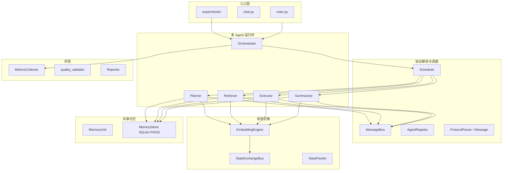

# 702solver 系统架构说明（课程/答辩入口）

> **版本**：v0.11.2  
> **一句话**：多 Agent 在**结构化协议**下协作，用 **MessagePack 消息 + 384 维语义向量 + 共享记忆** 降低文本 token 开销；与**纯文本协作基线**在相同任务集上可复现对比。  
> **实验数据**：[STATUS_SUMMARY.md](STATUS_SUMMARY.md) · [full24_controlled_comparison.md](full24_controlled_comparison.md)

---

## 0. 从哪里开始（入口）

| 你想做什么 | 命令 / 文件 |
|------------|-------------|
| **统一实验入口（中文、多模式、逐题指标）** | **`python3 run.py`** |
| **跑标准对照实验（24 题三方对照）** | `python3 experiments/full24_controlled_comparison.py` |
| **结构化 vs 文本（同代码库双模式）** | `python3 main.py experiment` |
| **连续 ≥10 轮关联任务** | `python3 main.py continuous --num-tasks 10` |
| **单任务调试** | `python3 main.py single "任务描述" --mode structured` |
| **交互式对话** | `python3 chat.py`（`/mode structured\|text`） |
| **看指标 JSON** | `output/results/full24_controlled_comparison.json` |
| **协议与消息定义** | `src/protocol/__init__.py` |
| **编排核心** | `src/orchestrator.py` |

```bash
# 环境
echo 'DEEPSEEK_API_KEY=你的密钥' >> .env

# 日常/答辩推荐：交互式中文向导
python3 run.py

# 命令式：模式2 + 连续12轮关联任务
python3 run.py --mode 1,2 --suite continuous12 -y

# 完整 24 题三方对照（耗时最长）
python3 experiments/full24_controlled_comparison.py --skip-pure-text
```

---

## 1. 总体架构（五层 + 四 Agent）



**单任务执行链（结构化模式）**

1. `Orchestrator.execute_task` 启动评测计时  
2. 可选 **E2E 记忆命中**（整题复用，带意图门控）  
3. **Planner**：`ActionType.PLAN` → 子任务 DAG  
4. 按依赖层并行：**Retriever** / **Executor** / **Summarizer**  
5. 各步经 **Scheduler** 发结构化 `Message`，附带 `state_embedding`、`memory_refs`  
6. 结果写入 **MemoryStore**，**MetricsCollector** 汇总消息/token/向量/记忆命中  

---

## 2. 课程要求对照表

| 要求 | 实现位置 | 说明 |
|------|----------|------|
| **结构化通信**（动作、参数、结果、能力） | `src/protocol/__init__.py` | `Message`：`action`/`params`/`result`/`capabilities`；MessagePack 序列化 |
| **握手 / 能力发现 / 协议映射** | `src/protocol/scheduler.py` | `Scheduler.handshake`、`AgentRegistry`、`find_by_capability`；`CAPABILITY_QUERY`/`ADVERTISE` 消息类型已定义 |
| **纯文本 + 结构化双模式** | `Orchestrator.mode`、`BaseAgent.use_structured_protocol`；`experiments/pure_text_baseline.py` | 库内切换 + 独立纯文本基线（同任务集对照） |
| **非文本中间状态** | `src/state/embeddings.py`、`exchange.py`；`Message.state_embedding` | 384 维 BGE 向量；`StatePacket` 记录生成/传递/字节数 |
| **共享记忆单元** | `src/memory/models.py`、`store.py` | `MemoryUnit`：ID、来源 Agent、时间、主题、摘要、标签、证据链、向量等 |
| **关键词 / 标签 / 语义检索** | `MemoryStore.search_by_*`；`BaseAgent.query_memory` | 三种检索合并去重后供各 Agent 使用 |
| **≥2 组关联连续任务** | `experiments/tasks.py`；`benchmark_suites.py` | 能源组、安全组、`full24` 热记忆+对抗陷阱 |
| **消息次数、token、向量规模、耗时、记忆命中** | `src/evaluation/metrics.py`；实验 JSON | `TaskMetrics`、`ComparisonReport`、benchmark 输出 |
| **运行时 / 调度 / 状态 / 记忆 / 评测** | 见上文五层 | `pytest` 309+ 项；`continuous` ≥10 轮 |

---

## 3. 结构化通信机制（不得全文透传）

### 3.1 消息模型

每条 Agent 间消息为 **`Message` 对象**，序列化为 **MessagePack** 二进制（非自然语言长文）。

| 字段 | 含义 |
|------|------|
| `msg_type` | `request` / `response` / `handshake` / `capability_query` / `state_transfer` / `memory_*` / `error` |
| `action` | `plan` / `retrieve` / `execute` / `summarize` / `store_memory` / `query_memory` / … |
| `params` | 结构化输入，如 `task_description`、`task_id`、`tags`、`query`、`plan` |
| `result` | 结构化返回（计划 JSON、检索列表、执行输出、摘要 dict） |
| `capabilities` | 发送方能力列表（如 `plan`、`query_memory`） |
| `state_embedding` | 非文本：本步状态的 384 维向量 |
| `memory_refs` | 引用的 `memory_id` 列表 |

紧凑字典键：`h`（头）、`a`（动作）、`s`（状态）、`p`（载荷）——见 `Message.to_dict()`。

### 3.2 握手与能力发现

```text
Agent 初始化 → scheduler.handshake(agent_id, role, capabilities)
            → AgentRegistry.register + MessageBus 广播 HANDSHAKE
路由：route_task(action, params) → find_by_capability(action.value) → 目标 Agent
```

| 组件 | 文件 | 职责 |
|------|------|------|
| `AgentRegistry` | `scheduler.py` | 按 capability / role 索引 Agent |
| `MessageBus` | `scheduler.py` | 队列、历史、结构化 vs 文本 token 统计 |
| `Scheduler` | `scheduler.py` | 握手、路由、响应、聚合统计 |

### 3.3 与「纯文本透传」的区别

- **结构化模式**：`params` 为短字段 + JSON 子结构；状态主要靠 **向量 + memory_refs**。  
- **库内文本模式**：`use_structured_protocol=False`，`params["text_content"]` 承载长自然语言（用于同代码对比）。  
- **实验基线 A**：`pure_text_baseline.py` 三阶段长 prompt 散文，**不走** MessageBus（公平对照「无协议」上限）。

---

## 4. 非文本中间状态传递

| 阶段 | 实现 |
|------|------|
| **生成** | `EmbeddingEngine.encode()` / `encode_state(dict)`，默认 `BAAI/bge-small-en-v1.5` → **384 维** float32 |
| **传递** | ① `Message.state_embedding` 随协议消息；② `StateExchangeBus.transfer(StatePacket)` Agent 直连 |
| **接收** | 下游 Agent / `MemoryStore.search_by_similarity` 用向量检索；Summarizer 可做摘要-任务相关度过滤 |
| **使用** | Planner 模板匹配、E2E 缓存、记忆去重（cos>0.95）、跨任务 `_suggest_memories` |

`StatePacket` 元数据：`source_agent`、`target_agent`、`dimension`、`data_size_bytes`、`generation_method`、`source_context`。

**设计说明**：向量是状态的**语义压缩表示**，用于检索与相似度门控，**不**把完整隐藏状态无损还原为文本（避免假「神经透传」）。

---

## 5. 共享记忆模块

### 5.1 记忆单元 `MemoryUnit`

| 元数据 | 字段 |
|--------|------|
| 记忆 ID | `memory_id` |
| 来源 Agent | `source_agent` |
| 创建时间 | `created_at` |
| 任务主题 | `task_topic` / `task_id` |
| 摘要描述 | `summary` |
| 正文 | `content`（JSON：计划、结果、摘要结构等） |
| 标签 | `tags` |
| 证据链 | `evidence_chain`（其它 memory_id） |
| 语义向量 | `embedding` |
| 类型 | `memory_type`：`result` / `strategy` / `evidence` / `fact` / `error` |
| 抽象层级 | `abstraction_level`：0 实例 / 1 领域模板 / 2 原则 |

存储：**SQLite**（元数据 + BLOB 向量）+ **FAISS** `IndexFlatIP`（语义检索）。

### 5.2 检索方式

| 方式 | API | 用途 |
|------|-----|------|
| 关键词 | `search_by_keyword` | SQL `LIKE` 主题/摘要/内容 |
| 标签 | `search_by_tags` | 标签 OR 匹配 |
| 语义 | `search_by_similarity` | FAISS 余弦 Top-K |
| 统一入口 | `BaseAgent.query_memory` | 合并 + 分数阈值 + 访问计数 |

**跨任务复用**：Planner 计划缓存、Summarizer 摘要缓存、Orchestrator E2E；v0.11.2 **意图门控**（对比/合规/漏洞不混用）。

---

## 6. 双模式与可复现实验

### 6.1 三种「协作」口径

| 口径 | 代码 | 实验变体 |
|------|------|----------|
| 纯文本基线 | `experiments/pure_text_baseline.py` | **A**：每题 3 次 LLM，无记忆无协议 |
| 结构化无记忆 | `RunOptions` 关缓存 | **B**：有协议与 DAG，无记忆复用 |
| 结构化全功能 | `DEFAULT_OPTIONS` | **C**：记忆 + 模板 + E2E + Dropout |

### 6.2 关联任务组（验证复用效果）

**组 1 — 能源研究**（`experiments/tasks.py` → `TASK_GROUP_1`）

- `energy_task_1`：太阳能调研  
- `energy_task_2`：风电 vs 光伏对比（依赖组 1 记忆）

**组 2 — 代码安全**（`TASK_GROUP_2`）

- `code_task_1`：Python 漏洞模式  
- `code_task_2`：变体分析（复用组 2 模式记忆）

**组 3 — 标准基准**（`benchmark_suites.py`）

- `core12` + `extended6` + `adversarial6` = **`full24`**  
- **`continuous12`**：12 轮城市能源规划链（满足 ≥10 轮连续关联任务，`run.py --suite continuous12`）  
- 对抗 6 题：热记忆后考察**是否误用 E2E**（`no-e2e-cache` 标签）

**连续运行**：`python3 main.py continuous --num-tasks 10` → `experiments/runner.run_continuous_tasks`

### 6.3 当前主结果（full24，同条件）

| 变体 | Token | 质量 | C vs A 省 token |
|------|------:|------|----------------:|
| A 纯文本 | 95,377 | 24/24 | — |
| C 结构化 | 30,221 | 24/24 | **68.3%** |
| B 无缓存 | 49,540 | 24/24 | — |

详见 [full24_controlled_comparison.md](full24_controlled_comparison.md)。

---

## 7. 评测与指标

### 7.1 运行时采集（`MetricsCollector` / `TaskMetrics`）

| 指标类别 | 字段示例 |
|----------|----------|
| 消息 | `messages_sent/received` |
| 文本通信 | `structured_token_count`、`text_equivalent_token_count`、`communication_char_count` |
| 非文本 | `state_transfers`、`state_data_bytes`、`state_generation_ms` |
| 记忆 | `memory_queries`、`memory_hits`、`memory_hit_rate`、`cross_task_memories_used` |
| 耗时 | `total_elapsed_ms`、`llm_call_count` |
| API | `llm_prompt_tokens`、`llm_completion_tokens`、`llm_cached_tokens` |

### 7.2 实验输出

| 文件 | 内容 |
|------|------|
| `output/results/full24_controlled_comparison.json` | 三变体汇总 + **per_task** 逐题 |
| `output/results/structured_full24_controlled.json` | C 逐题策略/token/相关度 |
| `output/results/structured_nocache_full24.json` | B 逐题 |
| `output/results/pure_text_baseline_full24.json` | A 逐题 |
| `experiments/collect_system_metrics.py` | 离线：MessagePack vs JSON、检索吞吐 |

### 7.3 质量验证

`src/evaluation/quality_validator.py`：主题覆盖、禁止词、embedding 相关度、composite 分；benchmark 中 `run_quality=True`。

---

## 8. 源码目录（模块 → 职责）

```text
702solver/
├── main.py                 # CLI：experiment / continuous / single / chat / stats
├── chat.py                 # 交互入口
├── experiments/            # 可复现实验脚本（full24 对照为主）
│   ├── full24_controlled_comparison.py
│   ├── pure_text_baseline.py
│   ├── experiment_common.py
│   ├── benchmark_suites.py
│   └── tasks.py            # 关联任务组定义
└── src/
    ├── orchestrator.py     # 多 Agent 运行时编排
    ├── protocol/           # Message、ActionType、Scheduler、MessageBus
    ├── agents/             # Planner / Retriever / Executor / Summarizer
    ├── state/              # EmbeddingEngine、StateExchangeBus
    ├── memory/             # MemoryUnit、MemoryStore
    ├── evaluation/         # metrics、reporter、quality_validator
    ├── task_intent.py      # 缓存意图门控（对比/合规/漏洞）
    └── run_options.py      # 消融开关（缓存、Dropout、阈值）
```

---

## 9. 答辩表述建议（30 秒版）

本系统实现了 **MessagePack 结构化协议** 的多 Agent 协作，消息包含动作类型、参数、结果与能力描述，并具备握手与能力注册；同时支持 **结构化模式** 与 **纯文本模式**，在 **full24 同一任务集** 上实测结构化方案 **节省约 68% LLM token** 且 **24/24 质量通过**。Agent 间通过 **384 维语义向量** 与 **SQLite+FAISS 共享记忆** 传递非文本状态，支持关键词/标签/向量检索与跨任务复用；两组关联任务与 10 轮连续实验验证记忆复用可降低重复计算。评测模块统计消息数、token、向量字节、耗时与记忆命中率，架构分为运行时、协议调度、状态交换、共享记忆与评测五部分。

---

## 10. 相关文档

| 文档 | 用途 |
|------|------|
| [STATUS_SUMMARY.md](STATUS_SUMMARY.md) | 最新数字一页纸 |
| [experiment_design_v2.md](experiment_design_v2.md) | 24 题设计说明 |
| [PROJECT_RECORD.md](PROJECT_RECORD.md) | 项目过程记录 |
| [history/rounds/optimization_v0.11.2_compliance_relevance.md](history/rounds/optimization_v0.11.2_compliance_relevance.md) | 最近优化 |
